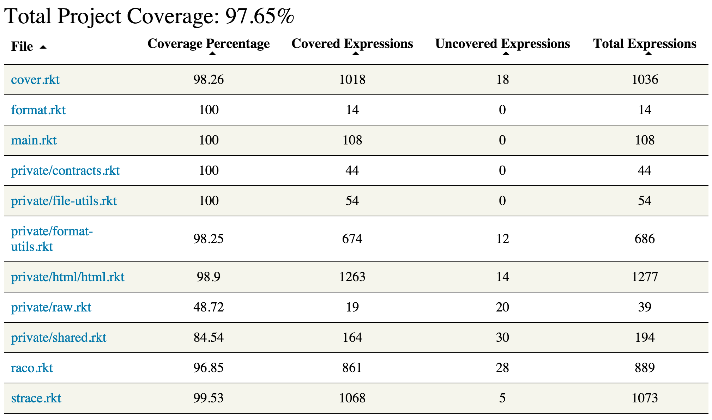
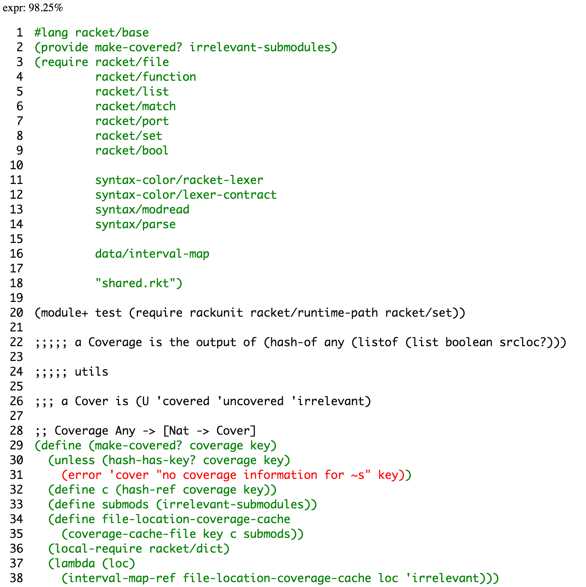

# Cover

This library is an extensible code coverage tool for racket. It comes with the ability to generate
HTML reports, and has extensions to submit coverage reports to [Codecov](https://codecov.io/) and
[Coveralls](https://coveralls.io/).  You can also create your own coverage formats.

## How to install

Install via `raco pkg install cover`, or from the `"File" -> "Install Package..."` menu in DrRacket.

## Basic Usage

The basic usage of Cover will generate an HTML report. For example, checkout and install this
library and run `raco cover .` in that directory. Then open `coverage/index.html` in your favorite
web browser. You should see something like this:

You can sort the entries by clicking on the header for any column. You can see a more detailed view
for any file by clicking on its name. For example, `private/format-utils.rkt` looks like:

You can view the arguments for Cover run `raco cover -h`.

## Different Formats

Code coverage can be generated in a different format by specifying the `-f <format>` flag.

The only built in format is `html` simply generates html files for each source file containing
coverage information and highlighted source code. This is the default.

If you would like to use Cover with [Codecov](https://codecov.io/) see
[cover-codecov](https://github.com/rpless/cover-codecov)

If you would like to use Cover with [Coveralls](https://coveralls.io/) see
[cover-coveralls](https://github.com/rpless/cover-coveralls).

You can also build a custom output format. For more detailed usage see
[the full documentation](http://pkg-build.racket-lang.org/doc/cover/index.html).

## Use with TravisCI

Cover works with Travis CI, however you may want to install an output format specialized to cover
coverage service, like [cover-coveralls](https://github.com/rpless/cover-coveralls).

## Gotchas and Bugs

There is a list of odd behavior you may encounter when using Cover in the
[Gotcha's Section](http://pkg-build.racket-lang.org/doc/cover/basics.html#%28part._.Gotcha_s%29)
of the documentation.

## Racket API

Cover comes with a racket API, which can be read about in
[the full documentation](http://pkg-build.racket-lang.org/doc/cover/index.html).

